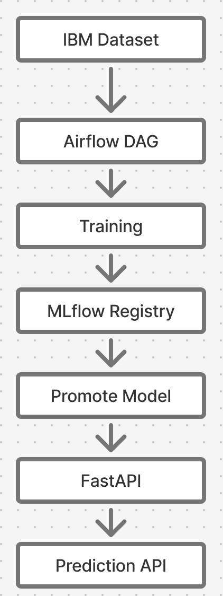

# Employee Attrition MLOps Platform

End-to-end MLOps project for predicting employee attrition risk.

## Business problem

The service estimates the probability that an employee will leave the company. The model is a decision-support tool for HR analysts and does not make personnel decisions automatically.

## Architecture



```text
Production data
      ↓
PostgreSQL production source
      ↓
Drift / quality event
      ↓
Feature Store
      ↓
Airflow
      ↓
Training
      ↓
MLflow Tracking + Registry
      ↓
Quality Gate
      ↓
Production model pointer
      ↓
FastAPI
      ↓
Prometheus metrics
```

## Level 2 MLOps components

- Git / GitHub — version control
- GitHub Actions — CI/CD
- PostgreSQL — mutable production data source
- Feature Store layer — prepared feature dataset and schema
- Airflow — orchestration
- MLflow — experiments and model registry
- FastAPI — online inference
- Prometheus client — API metrics
- Drift detection — KS test + TVD
- Docker Compose — declarative local infrastructure
- Render Blueprint — declarative cloud deployment

## Model

Baseline: Logistic Regression.

Baseline test metrics:

| Metric | Value |
|---|---:|
| ROC-AUC | 0.8034 |
| Precision | 0.8095 |
| Recall | 0.3617 |
| F1 | 0.5000 |

Quality gate:

- ROC-AUC ≥ 0.80
- Recall ≥ 0.36

## Production data simulation

A real HR database is not available for the course project. Therefore, the repository contains a PostgreSQL-backed production-data simulator.

The historical IBM dataset is loaded as a reference batch. New batches are then appended to PostgreSQL. Controlled changes in OverTime and MonthlyIncome intentionally create a detectable drift event.

In production this component is replaced by a connector to the company's HR database, DWH or streaming source without changing the downstream contract.

## Local run

```bash
docker compose up --build
```

Services:

- FastAPI: http://localhost:8000/docs
- FastAPI health: http://localhost:8000/health
- FastAPI metrics: http://localhost:8000/metrics
- Airflow: http://localhost:8081
- MLflow: http://localhost:8080
- MinIO: http://localhost:9001

Airflow DAG:

employee_attrition_retrain

Flow:

ingest → event detection → feature store → train → validate → promote

## Documentation

- [ML manifest](docs/ml_manifest.md)
- [SLI/SLO](docs/sli_slo.md)
- [MDD ADR](docs/adr_mdd_latency.md)
- [MDD analysis code](docs/mdd_analysis.py)